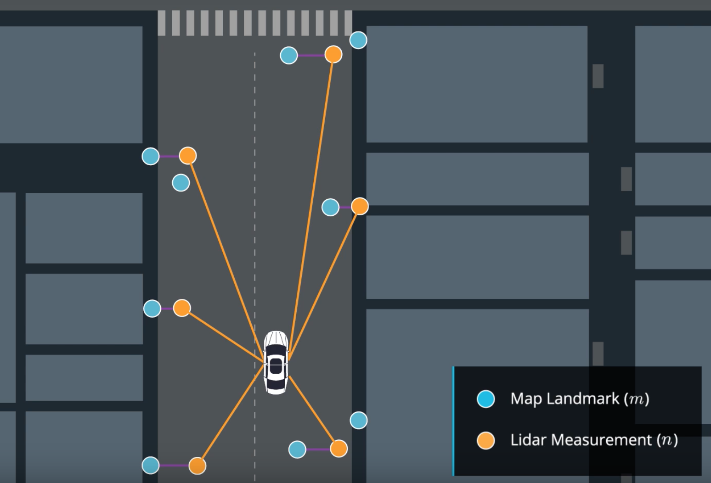
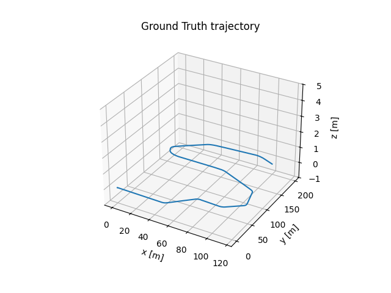
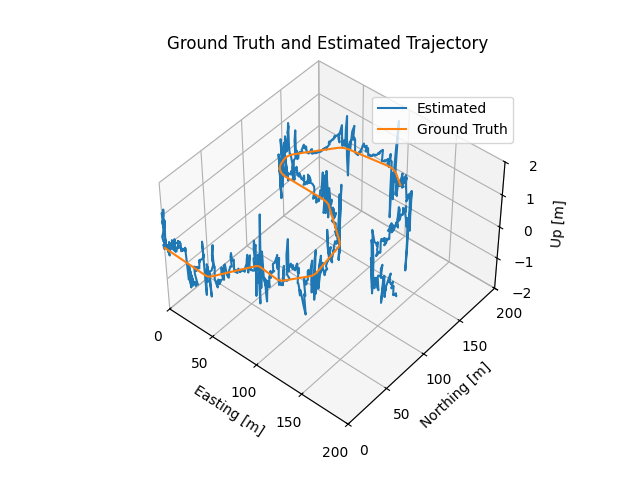
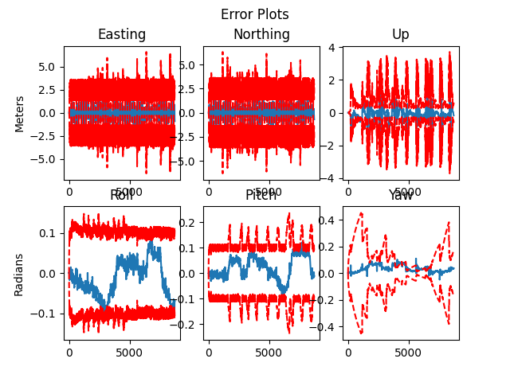
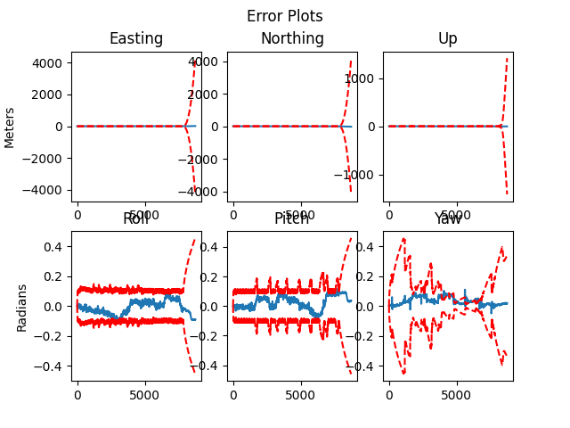

# Self Driving Cars State Estimation and Localization




## Run the filter:
    ```bash
    python3 es_ekf.py
    ```

## 📊 Results
### 🔹 Ground Truth Trajectory


### 🔹 Ground Truth vs Estimated Trajectory (Part 1)



### 🔹 Error Plots (Part 1)



---

### 🔹 Ground Truth vs Estimated Trajectory (Part 2)


### 🔹 Error Plots (Part 2)



> Replace the above image paths with your actual plot file locations inside the `plots/` folder.

## ⚙️ Sensor Variance Settings

You can tune the sensor variances inside `main.py` under the **Constants** section:
```python
var_imu_f = 0.1
var_imu_w = 1.0
var_gnss  = 0.01
var_lidar = 0.25
